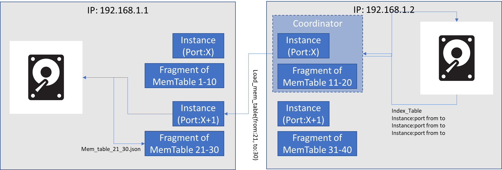

Pet In-Memory database. Ideally it will be:
1) Distributed
2) able to perform changes in one node and replicate to others
3) Fully RSOCKET based
4) ...?



Standalone docker image for development
[dockerfile](https://github.com/bcosso/nimpha/blob/main/dockerfile)
```
docker build -t imagename -f dockerfile .
docker run -it -p 10001:10000 -p 8001:8000 -p 9091:9090 imagename
```
For testing the docker image a post request to the localhost port 9091 with a query can be executed:
```
POST http://127.0.0.1:9091/execute_query_method HTTP/1.1
content-type: application/json

{
    "method": "execute_query",
    "query": "select * from table2"
}
```


TODO:
 - Update
 - Error treatment
 - Guarantee insert concurrency - Should be guaranteed by the elected WAL node as is
 - WAL node election mechanism
 - ~~Node unavailability treatment~~
 - Separate components in the code (refactor)
 - ~~Replication of WAL~~- WAL is replicated and on error (node down) triggers a data recovery event in one of the nodes
 - ~~Replication of data~~
 - Indexing mechanism (BTREE partially implemented)
 - ~~Sharding - Sharding strategy : TABLE~~
 - Sharding - Sharding strategies : Alphabetic order, index range, ...? 
 - ~~Convert from HTTP to a protocol lower in the OSI model~~ Done with RSOCKET
 - Remove non rsocket communication
 - refactor code to Golang standard naming convention. Started with snake case but had to change due to Golang standards.
 - ~~Drivers for usage by client systems~~ (Created HTTP load balancer. Clients should use post requests

TODO Parser:
 - ~~INSERT~~
 - DELETE
 - UPDATE
 - ~~select with subqueries~~
 - Select without where clause: Currently to get all rows we need a where clause containing an always true condition (i.e. where 1 = 1)  
 - Mathematical operations
 - ~~Case When~~
 - Nested Case When
 - ...
 
